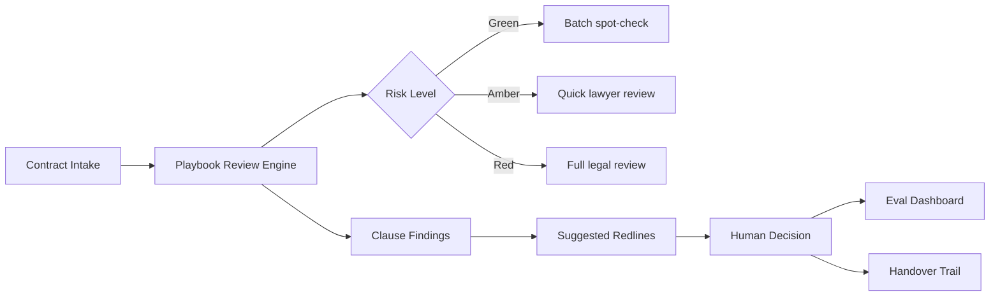

# Architecture and Data Flow

## System overview

Legal Queue Copilot is a single-page application (SPA) built with Vite, React 18, and TypeScript. The prototype uses localStorage for persistence. The architecture is structured so Supabase queries can replace localStorage calls directly.

---

## Data flow

```
Contract Intake (text/file)
        │
        ▼
  Playbook Review Engine
  (10 rule patterns applied)
        │
        ▼
  Risk Routing (Green / Amber / Red)
        │
        ▼
  Findings + Suggested Redlines
        │
        ▼
  Human Decision (Accept / Edit / Reject / Escalate)
        │
        ▼
  Eval Loop + Handover Trail
```

---

## Mermaid diagram



---

## Layers

### Frontend
- Vite + React 18 + TypeScript
- Tailwind CSS with custom design tokens
- Six pages: Command Centre, New Review, Review Results, Playbook, Evaluation, Handover
- Fully responsive — mobile hamburger nav, overflow-safe tables, stacked grids

### State and persistence
- `src/lib/store.ts` — in-memory state with localStorage serialisation
- `src/lib/supabase.ts` — Supabase client (gracefully no-ops when env vars absent)
- `supabase/migrations/` — schema applied: `contracts`, `reviews`, `playbook_rules`, `human_decisions`, `eval_tests`
- Row Level Security enabled on all tables; authenticated-user policies only

### Review engine
- `src/services/reviewEngine.ts` — deterministic regex-based mock engine
- `RISK_SIGNALS` array: 12 patterns mapped to clause types, severity, findings, and redline suggestions
- Risk routing: any High severity → Red; any findings → Amber; no findings → Green
- Simulated 1.2-second processing delay for realistic UX

### Playbook layer
- `src/data/playbookRules.ts` — 10 seeded rules
- Each rule: preferred position, acceptable fallback, escalation trigger, suggested wording, rationale
- Rules are editable in the Playbook page; stored to persistence layer
- In production: Legal owns and approves all playbook changes

### Human decision loop
- Each finding presents Accept / Edit / Reject / Escalate controls
- Decisions stored as `HumanDecision` objects with timestamp, finding reference, and optional edited text
- Decisions feed the Handover activity trail

### Evaluation layer
- `src/data/evalTests.ts` — 8 synthetic test cases with expected vs. actual risk and issue detection
- Metrics computed live: pass rate, routing accuracy, issue detection %, false positives, false negatives
- Realistic (not 100%): 87.5% pass rate, 1 false negative, 1 false positive, 2 partial passes

---

## Future production architecture

```
Browser (React SPA)
    │ fetch
    ▼
Supabase Edge Function (server-side)
    │ LLM API call (Anthropic/OpenAI)
    ▼
Structured JSON output (validated against schema)
    │
    ▼
Supabase Postgres (contracts, reviews, decisions)
    │
    ▼
React UI (read via Supabase JS client)
```

**Why API keys must not live in the frontend:**
Any key embedded in client-side code is visible to anyone with browser DevTools. API keys with LLM access should live exclusively in server-side functions (Edge Functions or serverless). The client authenticates with Supabase and calls the Edge Function; the Edge Function holds the LLM key and validates output before returning it.

---

## File structure (key files)

```
src/
  components/
    Layout.tsx          # Sidebar nav + mobile drawer
    RiskBadge.tsx       # Green/Amber/Red pill component
  data/
    evalTests.ts        # 8 synthetic eval cases
    playbookRules.ts    # 10 default playbook rules
    sampleContracts.ts  # 5 sample contract texts
  lib/
    store.ts            # localStorage persistence layer
    supabase.ts         # Supabase client singleton
  pages/
    Dashboard.tsx       # Command Centre queue
    NewReview.tsx       # Contract intake form
    ReviewResults.tsx   # Findings, redlines, decisions
    Playbook.tsx        # Rule management
    Evaluation.tsx      # Eval metrics and test cases
    ActivityLog.tsx     # Handover readiness + trail
  services/
    reviewEngine.ts     # Deterministic review engine
  types/
    index.ts            # All TypeScript interfaces
supabase/
  migrations/           # Schema + RLS migrations
  schema.sql
```

---

_Prototype architecture. Not production-hardened._
